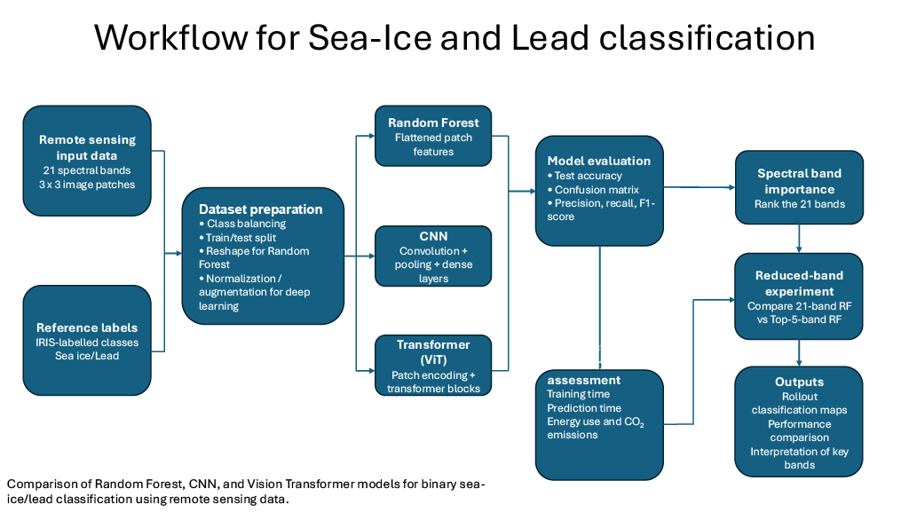
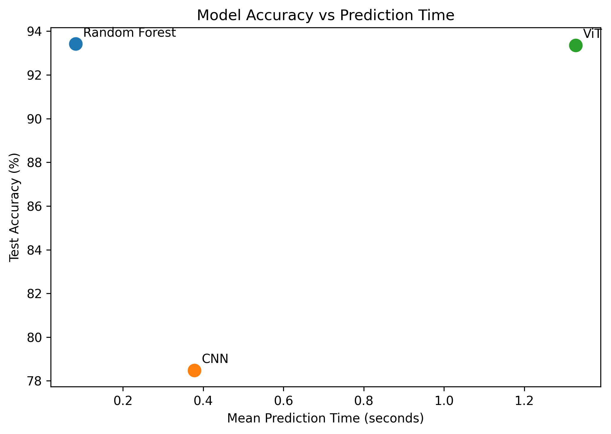
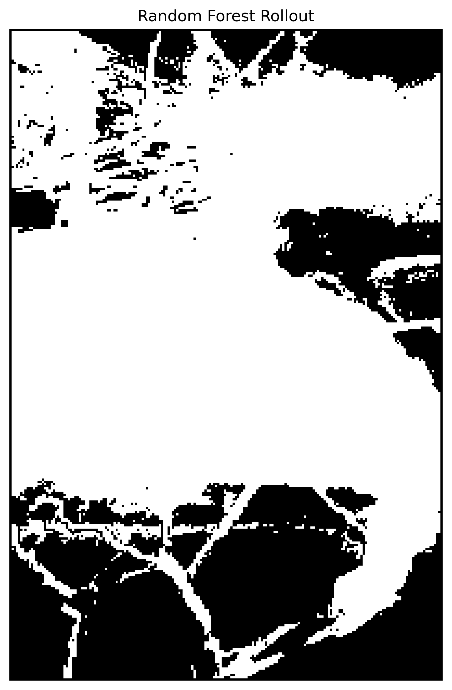
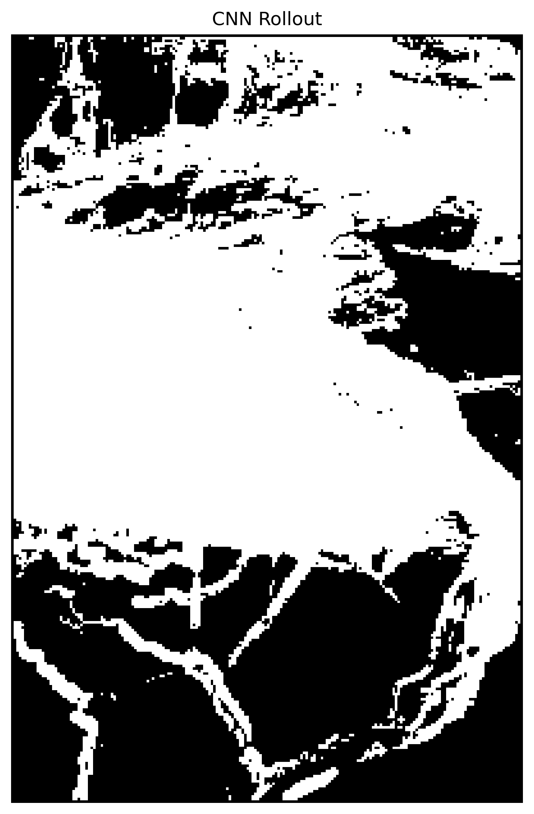
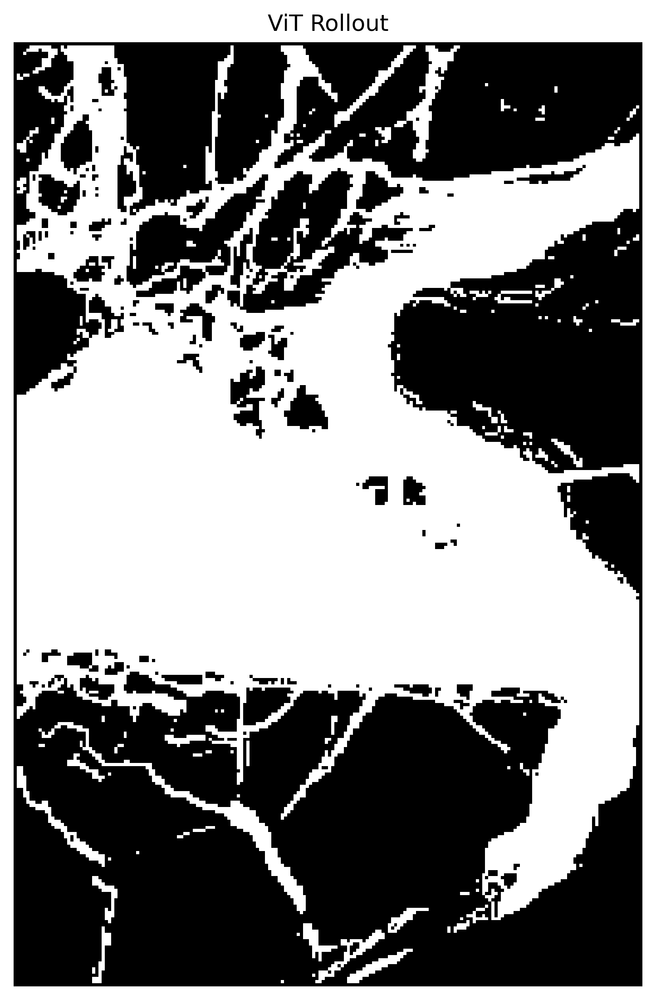
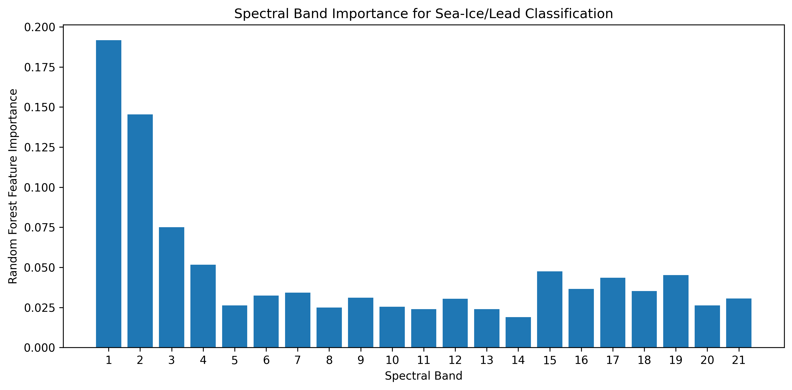
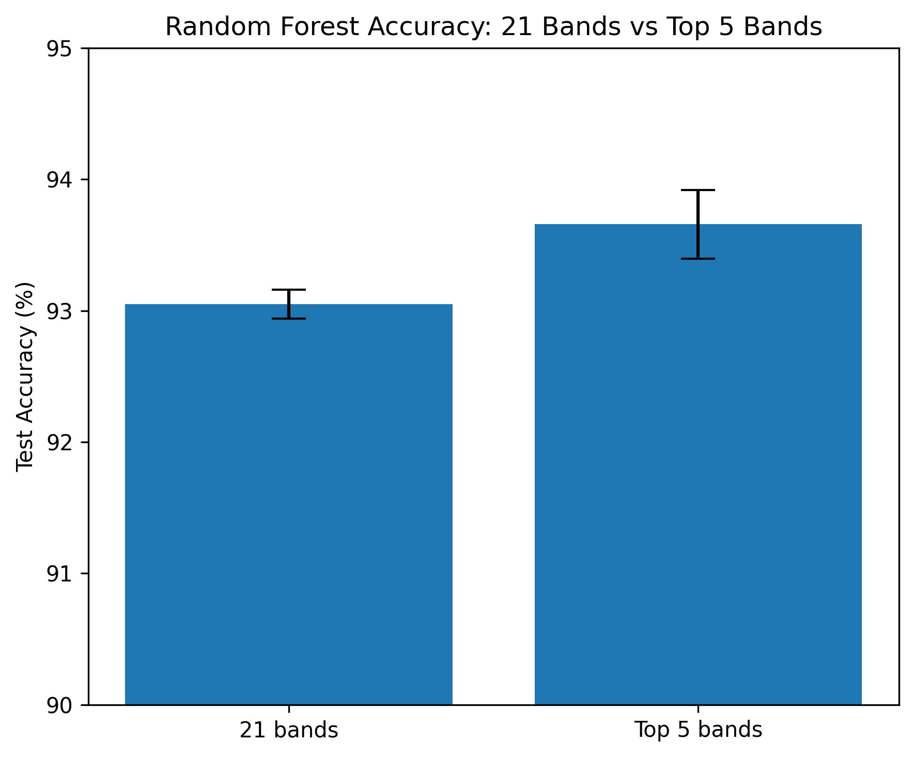

# Sea-Ice AI Classification

## Do all 21 spectral bands matter?

This project investigates binary sea-ice/lead classification from 21-band optical Earth-observation imagery. Three approaches are compared: **Random Forest (RF)**, a **Convolutional Neural Network (CNN)** and a **Vision Transformer (ViT)**. A reduced-band Random Forest experiment is then used to test whether spectral dimensionality can be reduced without sacrificing classification performance.

## Research question

**Can sea ice and leads be classified accurately from 21-band satellite imagery using a computationally efficient machine-learning approach, and can spectral feature selection reduce model complexity without sacrificing classification performance?**

## Project workflow



*Figure 1. Workflow for the sea-ice/lead classification project, from 21-band remote-sensing input data and IRIS reference labels through model training, evaluation, spectral-band analysis, reduced-band testing and computational/environmental assessment.*

## Workflow steps

1. Label sea-ice/lead regions using IRIS.
2. Extract labelled **3 × 3 × 21** image patches.
3. Balance the binary classes and split into training and test data.
4. Train RF, CNN and ViT classifiers.
5. Compare accuracy, precision, recall, F1 score and confusion matrices.
6. Apply the trained models to a spatial rollout region.
7. Calculate Random Forest feature importance by spectral band.
8. Retrain Random Forest using the five highest-ranked bands.
9. Compare predictive performance, runtime, energy use and CodeCarbon-estimated emissions.

## Model results

All three models were evaluated on the same held-out test set of **1,580 samples**.

| Model | Test accuracy | Macro F1 | Mean prediction time |
|---|---:|---:|---:|
| **Random Forest** | **93.42%** | **0.934** | **0.0828 s** |
| ViT | 93.35% | 0.934 | 1.3279 s |
| CNN | 78.48% | 0.785 | 0.3778 s |

Random Forest and ViT produced almost identical test accuracy, while CNN performed less well. Random Forest was also the fastest model at inference on the Colab runtime used for the comparison.



### Confusion matrices

- Random Forest: `[[734, 41], [63, 742]]`
- ViT: `[[723, 52], [53, 752]]`
- CNN: `[[621, 154], [186, 619]]`

The class labels are retained as **0** and **1** in the repository because the mask-label convention was not independently re-verified during the final comparison stage.

## Spatial rollout

The trained classifiers were applied to the same 300 × 200 rollout region from `image2.npy`. Predictions were reconstructed from the valid inner 298 × 198 patch grid to produce 2D classification maps.

### Random Forest



### CNN



### Vision Transformer



The rollout maps show clear spatial structure, but there is no independent full-region ground truth for this area, so differences between the three maps are treated as qualitative rather than as confirmed errors.

## Spectral-band importance

Random Forest feature importance was reshaped from the flattened **3 × 3 × 21** input and summed across the nine spatial positions to obtain one importance value per spectral band.

The five highest-ranked bands were:

| Rank | Band | Importance |
|---|---:|---:|
| 1 | **1** | **0.1918** |
| 2 | **2** | **0.1454** |
| 3 | **3** | **0.0751** |
| 4 | **4** | **0.0516** |
| 5 | **15** | **0.0474** |



The importance values describe this fitted Random Forest model and should not be interpreted as proof that the same spectral bands are universally the most important for sea-ice/lead discrimination.

## 21 bands versus top 5 bands

A reduced Random Forest model was trained using only Bands **1, 2, 3, 4 and 15**.

Across five Random Forest seeds:

| Input | Mean accuracy | Standard deviation |
|---|---:|---:|
| 21 bands | 93.05% | 0.10 percentage points |
| Top 5 bands | **93.66%** | 0.26 percentage points |



The reduced-band model retained comparable performance and produced slightly higher mean accuracy in these runs, although with slightly greater variability. This result is specific to the dataset and experiment used here.

## Computational efficiency

Mean Random Forest training time was:

| Input | Mean training time |
|---|---:|
| 21 bands | 14.206 s |
| Top 5 bands | 5.716 s |

Reducing the input from 21 to 5 bands reduced measured Random Forest training time by **59.8%**.

## Environmental cost

CodeCarbon was used to estimate energy consumption and associated CO2-equivalent emissions. The main comparison measured five complete Random Forest training runs for each spectral configuration.

| RF workload | Energy | Estimated emissions |
|---|---:|---:|
| 21-band, 5 training runs | 0.00044974 kWh | 0.00021173 kg CO2eq |
| 5-band, 5 training runs | 0.00018756 kWh | 0.00008830 kg CO2eq |

The five-band workload used approximately **58.3% less measured energy** and produced **58.3% lower CodeCarbon-estimated emissions** than the 21-band workload. The absolute values are small and specific to the Google Colab environment, so the relative comparison is the more useful result.

The environmental and societal discussion is provided in [`ASSESSMENT.md`](ASSESSMENT.md).

## Reproducibility

The complete analysis is in [`notebooks/Sea_Ice_AI_Classification.ipynb`](notebooks/Sea_Ice_AI_Classification.ipynb).

The course data are not redistributed in this repository. The notebook expects the following prepared arrays in the project directory:

- `X_train_balanced.npy`
- `X_test_balanced.npy`
- `y_train_balanced.npy`
- `y_test_balanced.npy`
- `image2.npy`

The analysis uses NumPy, pandas, Matplotlib, scikit-learn, TensorFlow/Keras, joblib and CodeCarbon. Dependencies are listed in [`requirements.txt`](requirements.txt).

The experiments were carried out in **Google Colab**, including T4 GPU acceleration for the neural-network training. Runtime and CodeCarbon measurements are hardware-dependent.

## Repository structure

```text
Sea-Ice-AI-Classification/
├── README.md
├── ASSESSMENT.md
├── requirements.txt
├── .gitignore
├── notebooks/
│   ├── README.md
│   └── Sea_Ice_AI_Classification.ipynb
├── figures/
│   ├── README.md
│   ├── Workflow_Sea_Ice_Lead_Classification.png
│   ├── RF_image2_sample1_25208373.png
│   ├── CNN_image2_sample1_25208373.png
│   ├── ViT_image2_sample1_25208373.png
│   ├── Spectral_Band_Importance.png
│   ├── RF_21_vs_5_Bands.png
│   └── Accuracy_vs_Prediction_Time.png
└── results/
    ├── model_metrics.csv
    ├── band_reduction_metrics.csv
    └── environmental_metrics.csv
```

## Limitations

- The experiments use a limited manually labelled region from one image, so performance cannot automatically be assumed to generalise to other locations, dates, illumination conditions or sensors.
- Manual masks introduce possible labelling uncertainty.
- Random Forest impurity-based feature importance can be influenced by correlated predictors.
- Five Random Forest seeds provide a repeatability check rather than evidence of universal superiority.
- Timing and CodeCarbon values depend on the Colab runtime and hardware allocation.
- The spatial rollout does not have independent ground truth across the full region.
